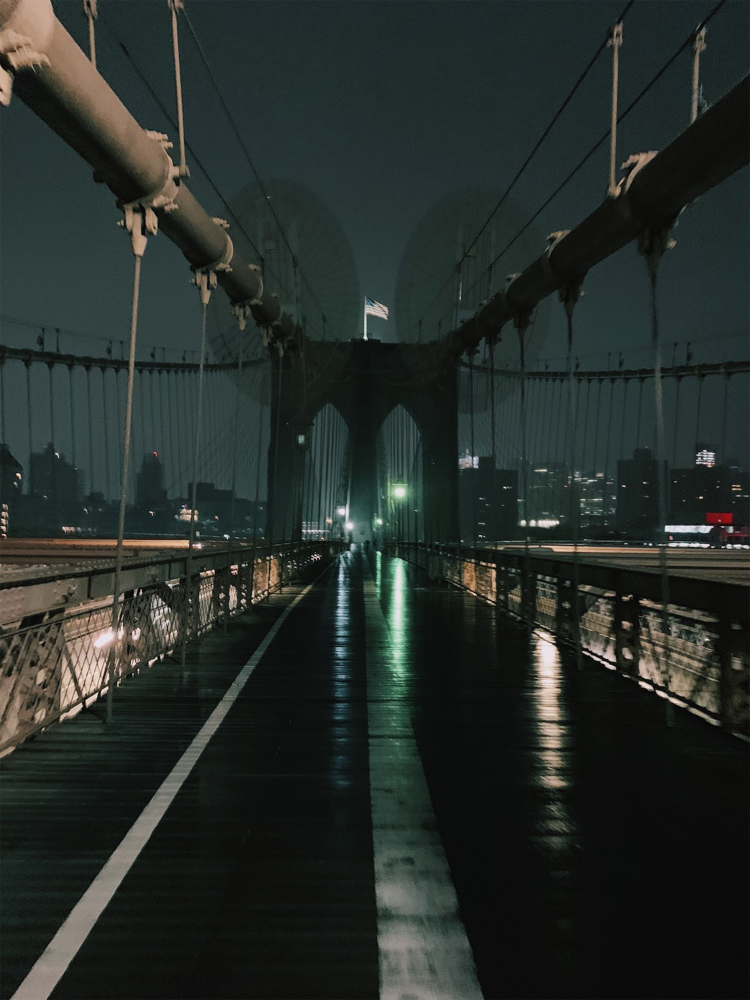

Going From MSY to JFK, our flight was delayed. We arrived in New York a little after 12am. Sadiq’s cousin, Ibrahim, offered to hold our bags at his place in Brooklyn and help us to navigate the subway towards Time’s Square. Uber’s were crazy expensive from JFK to Brooklyn, but based on Uber and Lyft searches through the night/morning, it seems like that was the norm. We walked around Times Square for a minute, looking for a slice of pizza, and stumbled upon Ray’s. The slices were expensive and did not meet my expectations for a NY slice, but were sufficient for a meal at 3:30am. After eating, the time was around 4am. We headed to Grand Central Station to catch the subway to the Brooklyn Bridge. We walked across the Brooklyn Bridge, which provided awesome views and a heavy misting. By the time we arrived back to Ibrahim’s crib, it was about 5:30. After a 30 minutes break there, we began our trek to EWR. We got some bagels at Penn Station before catching the NJ Transit to EWR. At EWR, security was a breeze. We attempted to find the Priority Pass lounge, but there was not one in our terminal, and would have required us to go through security twice more. We decided against it and walked to our gate. I had a glorious nap before we boarded. The flight was long but bearable.

